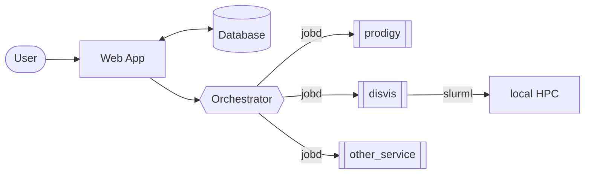

# orchestrator


[](https://github.com/rvhonorato/orchestrator/actions/workflows/ci.yml)
[](https://app.codacy.com/gh/rvhonorato/orchestrator/dashboard?utm_source=gh&utm_medium=referral&utm_content=&utm_campaign=Badge_grade)

## Overview

This is a central component [WeNMR](https://wenmr.science.uu.nl), a worldwide
e-Infrastructure for NMR and structural biology - operated by
the [BonvinLab](https://bonvinlab.org) at the [Utrecht University](https://uu.nl).
It is closely coupled with [`jobd`](https://github.com/rvhonorato/jobd),
with more destinations to be added in the future such as:

- [DIRAC Interware](https://dirac.readthedocs.io/en/latest/index.html)
- Educational cloud services
- SLURM

This is an asynchronous job orchestration system written in Rust that
manages and distributes computational jobs across research software
apps. Its a reactive middleware layer between the backend and various
computing resources, implementing quota-based load balancing.



## Example deployment

```bash
$ docker compose \
  -f deployment/docker_compose.yml \
  --project-directory .\
  up
```

### Create a dummy run script

```bash
$ cat <<EOF > run.sh
#!/bin/bash
# Pretend we are calculating something
sleep $((RANDOM % 3 + 1))m
# Done!
echo 'This is a downloadable file.' > output.txt
EOF
```

### POST it

```bash
$ curl -s -X POST http://localhost:5000/upload \
  -F "file=@run.sh" \
  -F "user_id=1" \
  -F "service=generic" | jq
```

It will return some information:

```json
{
  "id": 1,
  "user_id": 1,
  "service": "generic",
  "status": "Queued",
  "loc": "/opt/data/978e5a14-dc94-46ab-9507-fe0a94d688b8",
  "dest_id": ""
}
```

### CHECK the status

```bash
$ curl -I http://localhost:5000/download/1
HTTP/1.1 202 Accepted
content-length: 0
date: Mon, 06 Oct 2025 14:10:44 GMT
```

- `200`, File downloaded successfully
- `202`, Job not ready,
- `204`, Job failed or cleaned
- `404`, Job not found
- `500`, Internal server error

### GET it

```bash
$ curl -I http://localhost:5000/download/16
HTTP/1.1 200 OK
content-type: application/octet-stream
content-length: 380
date: Mon, 06 Oct 2025 14:13:16 GMT
```

```bash
curl -o results.zip http://localhost:5000/download/1
```

### Extra: Submit a large volume to see the queue in action

```bash
for i in {1..100}; do
  cat <<EOF > run.sh
#!/bin/bash
# Pretend we are calculating something
sleep \$((RANDOM % 3 + 1))m
# Done!
echo 'This is a downloadable file.' > output.txt
EOF
  curl -s -X POST http://localhost:5000/upload \
    -F "file=@run.sh" \
    -F "user_id=1" \
    -F "service=generic"
done

```

## Implementation

🚧 soon 🚧

## Docs

🚧 soon 🚧

## Contact

If you think this project would be useful for your use case or would like to
suggest something, please reach out either via issue here or via email. (:
